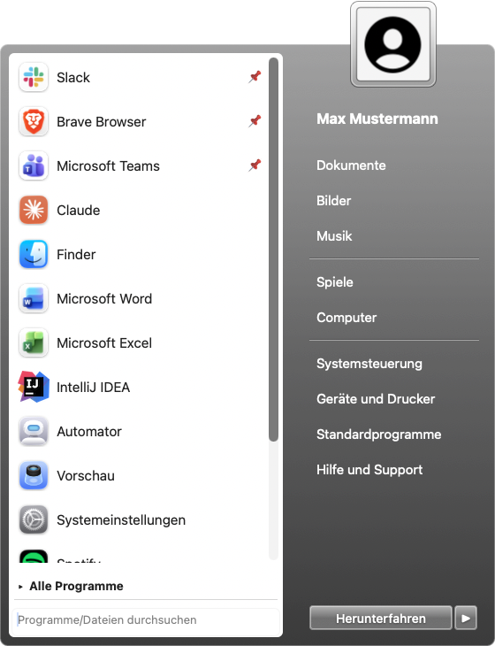

# Windows 7 Taskbar für macOS

Ein nativer **Dock-Ersatz für macOS** im Stil der Windows-7-Taskleiste — geschrieben in
Swift/AppKit, ohne externe Abhängigkeiten. Aero-Glas-Optik, animierter Start-Orb,
Zweispalten-Startmenü, Fenstervorschau (Aero Peek), Fenstergruppierung, Platz-Reservierung,
System-Tray und vieles mehr.


<p align="center">
  
  &nbsp;&nbsp;
  
</p>

> Alle Screenshots sind anonymisiert (Platzhalter-Benutzer „Max Mustermann").

---

## Funktionen

### Taskleiste
- Durchgehende **Aero-Glas-Leiste** am unteren Rand (60 px, halbtransparent mit Blur).
- **Start-Orb** mit eigener Grafik und drei animiert übergeblendeten Zuständen:
  Standard → Hover → *Startmenü geöffnet*. Orb auswählbar (siehe unten).
- **Taskbar-Buttons** für laufende & angepinnte Apps (nur Icons, 56 px). Klickverhalten
  wie beim Dock:
  - offene Fenster → in den Vordergrund / ausblenden
  - nur minimierte Fenster → wiederherstellen
  - läuft ohne Fenster → neues Fenster öffnen
  - nicht gestartet → Programm starten
  - **Mittelklick** → neues Fenster
- **Einzelklick** funktioniert sofort, auch wenn eine andere App im Vordergrund ist
  (nicht-aktivierendes Panel — kein „Doppeltipp").
- **Fenstergruppierung**: Apps mit mehreren Fenstern zeigen gestaffelte Rahmenkanten;
  Klick öffnet die Fenstervorschau zum Auswählen.
- **Drag & Drop**: Apps auf die Leiste ziehen → angepinnt.
- **Umsortieren** der Icons per Drag & Drop.
- **Aktiv-Highlight** als glasig-durchsichtiges Glas (kein harter Farbton).

### Startmenü
- **Zweispalten-Layout**: links weiße Programmliste (mit Akzent-/Aero-Rahmen), rechts das
  Glas-Panel mit Orten & Energie-Aktionen, oben das überstehende Profilbild im Glasrahmen.
- **Zwei Stile** wählbar: **Akzentfarbe** oder **Taskbar-Aero** (dunkles Glas) — Button und
  Avatar-Rahmen passen sich an.
- **Zuletzt geöffnete** Programme (selbst getrackt), angepinnte zuoberst.
- **„Alle Programme"** zeigt die vollständige Liste (flüssig, asynchron geladene Icons).
- **Suche** über Programme **und Dateien/Ordner** (Spotlight); **Enter** startet den ersten Treffer.
- **Rechtsklick** auf einen Eintrag: an Startmenü/Taskleiste anheften, Desktopverknüpfung erstellen.
- Energie-Aktionen: **Energie sparen / Neu starten / Abmelden / Herunterfahren** (Splitbutton).

### Fenstervorschau (Aero Peek)
- Live-Thumbnails der Fenster beim Hovern (ScreenCaptureKit), inkl. **minimierter** Fenster.
- **×-Knopf** zum Schließen eines Fensters; Klick auf eine Vorschau holt es nach vorn.

### System-Tray
Mit einheitlichem Abstand: **Now-Playing** (Spotify/Apple Music mit Fortschritt),
**Hardware-Monitor** (CPU/RAM), **WLAN**, **Akku**, **Lautstärke** (Slider), **Uhr**
(Klick → Kalender). Now-Playing, WLAN und Hardware-Monitor sind einzeln abschaltbar.

### Fensterverwaltung
- **Platz-Reservierung**: hält Fenster über der Leiste (Bedienungshilfen-API).
- **Vollbild**: Leiste blendet sich automatisch aus, wenn eine App im Vollbild ist.
- **macOS-Dock ausblenden** per Einstellung.

### Jump-Lists (Rechtsklick auf ein Taskbar-Icon)
- **Browser** (Brave/Chrome/Edge/Chromium/Vivaldi): Profile auswählen
- **Finder**: persönliche Ordner; **„Alle Fenster schließen"** (Finder wird nie beendet)
- **Terminal**: neues Fenster · **Mail**: neue Nachricht · **Spotify/Music**: Steuerung · **VS Code**: neues Fenster

### Einstellungen

<p align="center"></p>

Rechtsklick auf den Orb → **Einstellungen…**, in Tabs gegliedert:
- **Allgemein**: Dock ausblenden, Fensterbereich reservieren, Autostart (`SMAppService`)
- **Darstellung**: Start-Symbol (Orb-Auswahl + eigene laden), Startmenü-Stil, Icon-Rahmen über volle Höhe
- **Tray**: Now-Playing, WLAN, Hardware-Monitor
- **Finder**: Klick öffnet neues Fenster, Desktopfenster ignorieren

### Tastatur
- **fn (Globe) + Control** → Startmenü öffnen/schließen
- **Ctrl + 1…9** → n-te angepinnte App starten/aktivieren

---

## Installation

Voraussetzungen: **macOS 14+**, Xcode-Toolchain (Swift 5.9+).

```bash
# (Einmalig, empfohlen) stabile Signatur → erteilte Berechtigungen überleben Rebuilds:
./setup-signing.sh

./build.sh
open Win7Taskbar.app
```

Ohne `setup-signing.sh` wird ad-hoc signiert (funktioniert ebenfalls, Berechtigungen müssen
dann nach jedem Rebuild neu erteilt werden).

### Eigene Orbs
Orbs liegen in `orbs/` (Windows 7 + Apple) und werden eingebunden. Zur Laufzeit durchsucht die
App zusätzlich `~/Library/Application Support/Win7Taskbar/orbs/` — dort abgelegte PNGs
erscheinen in der Auswahl (oder per „Orb hinzufügen…" im Einstellfenster). Ein Orb-PNG hält die
drei Zustände vertikal gestapelt (normal / Hover / geöffnet).

---

## Berechtigungen

| Berechtigung | Wofür |
|---|---|
| **Bildschirmaufnahme** | Vorschaubilder der Fenster (Aero Peek) |
| **Bedienungshilfen** | Platz-Reservierung, minimierte Fenster, Fenster schließen/wiederherstellen, Hotkeys |
| **Automatisierung** (Finder/System Events/Spotify/Music) | Energie-Aktionen, Finder-Fenster, Now-Playing |

Alle unter *Systemeinstellungen → Datenschutz & Sicherheit* aktivieren.

---

## Autostart

Im Einstellfenster (*Allgemein → Beim Anmelden automatisch starten*) oder unter
*Systemeinstellungen → Allgemein → Anmeldeobjekte*.

---

## Projektaufbau

```
Sources/Win7Taskbar/
  main.swift / AppDelegate.swift     Einstieg (Agent-App), Erzeugung pro Bildschirm
  TaskbarController.swift            Fenster, Layout, laufende Apps, Tray, Vollbild, Hotkeys, Drag&Drop
  Theme.swift                        Maße & Farben (inkl. Akzentfarben-Helfer)
  GlassBackgroundView.swift          Aero-Glas-Hintergrund + Drop-Ziel
  StartOrbButton.swift / OrbCatalog  Animierter Orb + Orb-Verwaltung
  TaskbarButton.swift / TaskbarItem  Taskbar-Button (Zustände, Gruppierung) + Modell
  StartMenu.swift                    Startmenü (Layout, Suche, Avatar, Stile, Buttons)
  AppScanner / RecentsStore / PinStore   Programme finden, zuletzt geöffnet, Pins
  WindowPreview(.Controller).swift   Fensterliste + Thumbnails (ScreenCaptureKit/AX) + Aero-Peek-Panel
  WindowSpaceReserver.swift          Platz-Reservierung (Bedienungshilfen)
  SystemInfo / SystemStats / TrayWidgets  Akku, Lautstärke, CPU/RAM, WLAN-/Monitor-Widgets
  NowPlaying(.View).swift            Spotify/Music-Abfrage + Widget
  JumpList.swift                     App-spezifische Rechtsklick-Aktionen
  SettingsWindow.swift               Einstellfenster (Tabs)
  DockHelper.swift                   Dock ausblenden/einblenden
```

---

## Bekannte Grenzen

- Eine Drittanbieter-App kann **keinen** echten OS-Slot wie das Dock reservieren; die
  Reservierung hält Fenster per Bedienungshilfen oberhalb der Leiste.
- Das macOS-Dock lässt sich nicht vollständig beenden — die App versetzt es in den Auto-Hide.
- Fremde Menüleisten-Symbole anderer Apps lassen sich nicht in den Tray holen; systemweite
  Now-Playing-Infos sind für Fremd-Apps gesperrt, daher die direkte Spotify/Music-Abfrage.

---

## Lizenz

Privates Projekt. Windows 7 und das Windows-Logo sind Marken der Microsoft Corporation —
dieses Projekt ist ein nicht-kommerzieller, optischer Nachbau ohne Verbindung zu Microsoft.
