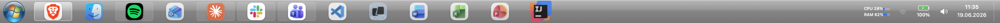
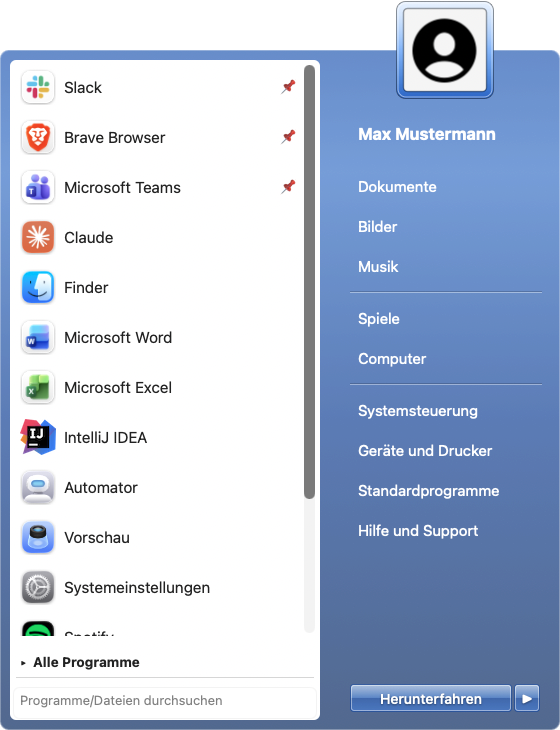
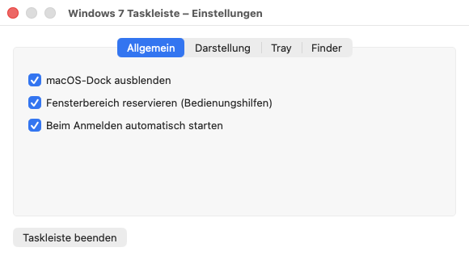

# Windows 7 Taskbar für macOS

Ein nativer **Dock-Ersatz für macOS** im Stil der Windows-7-Taskleiste — geschrieben in
Swift/AppKit, ohne externe Abhängigkeiten. Aero-Glas-Optik, animierter Start-Orb,
Zweispalten-Startmenü, Fenstervorschau (Aero Peek), Platz-Reservierung und ein System-Tray.



<p align="center">
  
</p>

> Die Screenshots sind anonymisiert (Platzhalter-Benutzer „Max Mustermann").

---

## Funktionen

### Taskleiste
- Durchgehende **Aero-Glas-Leiste** am unteren Bildschirmrand (60 px), halbtransparent mit Blur.
- **Start-Orb** mit eigener Grafik (`orb.png`) und weichen Hover-/Press-Animationen
  (drei Zustände, sanft übergeblendet).
- **Taskbar-Buttons** für laufende & angepinnte Apps — nur Icons, mit Aktiv-/Laufend-Anzeige.
  Klickverhalten wie beim Dock:
  - offene Fenster → in den Vordergrund / ausblenden
  - nur minimierte Fenster → wiederherstellen
  - läuft ohne Fenster → neues Fenster öffnen
  - nicht gestartet → Programm starten
- **Anheften/Lösen** per Rechtsklick.
- **System-Tray** rechts: Akku-Anzeige, Lautstärke (Klick → Slider/Mute), Uhr (Klick → Kalender),
  **WLAN-Symbol** und optionaler **Hardware-Monitor** (CPU/RAM) — beide abschaltbar.
- **Now-Playing-Spieler** (optional): aktueller Titel aus **Spotify / Apple Music** mit
  Zurück / Play-Pause / Vor und **Fortschrittsbalken**.
- **„Desktop anzeigen"**-Streifen ganz rechts.
- **Drag & Drop**: Taskbar-Icons lassen sich flüssig umsortieren.
- **Mittelklick** auf ein Icon öffnet ein neues Fenster.
- **Jump-Lists** per Rechtsklick: Chromium-Profile (Brave/Chrome/…), Finder-Ordner,
  Terminal (neues Fenster), Mail (neue Nachricht), Spotify/Music (Steuerung), VS Code.

### Startmenü
- **Zweispalten-Layout** im Win7-Stil: links eine deckend weiße Programmliste, eingefasst von
  einem akzentfarbenen Rahmen; rechts das akzentfarbene Glas-Panel mit Orten & Energie-Aktionen.
- **Zuletzt geöffnete Programme** (selbst getrackt) — **anpinnbar** per Rechtsklick.
- **„Alle Programme"** schaltet auf die vollständige, alphabetische Liste um.
- **Suche** über Programme **sowie Dateien und Ordner** (via Spotlight).
- **Profilbild** des angemeldeten Benutzers in einem glasigen Win7-Rahmen, ragt oben heraus.
- Energie-Aktionen: **Energie sparen / Neu starten / Abmelden / Herunterfahren** (Splitbutton).
- Verknüpfungen rechts auf macOS-Pendants gemappt (Dokumente, Bilder, Musik, Computer,
  Systemeinstellungen, …).

### Fenstervorschau (Aero Peek)
- Beim Hovern über ein laufendes Programm erscheint eine Vorschau seiner **Fenster** als
  Live-Thumbnails (via ScreenCaptureKit).
- **Minimierte Fenster** werden mit App-Icon-Platzhalter gelistet.
- **×-Knopf** zum Schließen eines Fensters; Klick auf eine Vorschau holt es nach vorn.

### Fensterverwaltung
- **Platz-Reservierung**: Fenster, die in den Leistenbereich ragen, werden über die Leiste
  geklemmt (Bedienungshilfen-API).
- **Vollbild**: Im echten Vollbildmodus blendet sich die Leiste automatisch aus.
- **macOS-Dock ausblenden** per Rechtsklick auf den Orb.

### Einstellungen
Rechtsklick auf den Orb → **Einstellungen…** öffnet ein zentrales Fenster mit allen Optionen:

<p align="center">
  
</p>

- macOS-Dock ausblenden
- Fensterbereich reservieren (Bedienungshilfen)
- Finder-Klick öffnet immer ein neues Fenster
- Now-Playing-Spieler anzeigen
- WLAN-Symbol anzeigen
- Hardware-Monitor (CPU/RAM) anzeigen
- Beim Anmelden automatisch starten (`SMAppService`)

### Sonstiges
- Nutzt die in macOS gewählte **Akzentfarbe** durchgängig (Highlights, Startmenü, Orb-Glow).
- **Globaler Hotkey**: **fn (Globe) + Control** öffnet/schließt das Startmenü.
- **Ctrl + 1…9** startet/aktiviert die n-te angepinnte App (Win-Tasten-Stil).
- **Enter** im Startmenü startet den ersten Suchtreffer.
- Reagiert zusätzlich auf eine Distributed Notification (`de.batix.win7taskbar.toggleStart`).

---

## Installation

Voraussetzungen: **macOS 14+**, Xcode-Toolchain (Swift 5.9+).

```bash
# 1) (Einmalig, empfohlen) Stabile Signatur, damit erteilte Berechtigungen Rebuilds überleben.
#    Erzeugt ein selbst-signiertes Zertifikat (einmalige Passwort-Abfrage).
./setup-signing.sh

# 2) Bauen und starten
./build.sh
open Win7Taskbar.app
```

Ohne `setup-signing.sh` wird die App ad-hoc signiert — funktioniert ebenfalls, allerdings
müssen die Berechtigungen nach jedem Rebuild neu erteilt werden.

### Eigenes Orb-Bild
Lege ein `orb.png` ins Projektverzeichnis (drei Zustände vertikal gestapelt: normal / Hover /
gedrückt). `build.sh` bindet es automatisch ein.

---

## Berechtigungen

Beim ersten Start fragt macOS nach Berechtigungen — bitte unter
*Systemeinstellungen → Datenschutz & Sicherheit* aktivieren:

| Berechtigung | Wofür |
|---|---|
| **Bildschirmaufnahme** | Vorschaubilder der Fenster (Aero Peek) |
| **Bedienungshilfen** | Platz-Reservierung, minimierte Fenster, Fenster schließen/wiederherstellen |
| **Automatisierung** (Finder/System Events/Spotify/Music) | Energie-Aktionen, „neues Finder-Fenster", Now-Playing-Steuerung |

---

## Autostart

Als Anmeldeobjekt einrichten: *Systemeinstellungen → Allgemein → Anmeldeobjekte* →
`Win7Taskbar.app` hinzufügen. (Lässt sich dort jederzeit wieder entfernen.)

---

## Projektaufbau

```
Sources/Win7Taskbar/
  main.swift                  Einstiegspunkt (Agent-App, kein Dock-Icon)
  AppDelegate.swift           Erzeugt die Leiste, reagiert auf Bildschirmänderungen
  TaskbarController.swift      Fenster, Layout, laufende Apps, Tray, Vollbild-Logik
  Theme.swift                 Maße & Farben (inkl. Akzentfarben-Helfer)
  GlassBackgroundView.swift   Aero-Glas-Hintergrund der Leiste
  StartOrbButton.swift        Animierter Start-Orb
  TaskbarButton.swift         Einzelner Taskbar-Button (Icon, Zustände)
  TaskbarItem.swift           Modell für einen Eintrag
  StartMenu.swift             Komplettes Startmenü (Layout, Suche, Avatar, Buttons)
  AppScanner.swift            Findet installierte Programme
  RecentsStore.swift          Zuletzt geöffnet + angepinnte Programme
  PinStore.swift              Angepinnte Taskbar-Apps
  WindowPreview.swift         Fensterliste + Thumbnails (ScreenCaptureKit/AX)
  WindowPreviewController.swift  Vorschau-Panel (Aero Peek)
  WindowSpaceReserver.swift   Platz-Reservierung über Bedienungshilfen
  SystemInfo.swift            Akku (IOKit) & Lautstärke
  SystemStats.swift           CPU-/RAM-Auslastung (Mach-APIs)
  TrayWidgets.swift           WLAN-Symbol & Hardware-Monitor
  JumpList.swift              App-spezifische Rechtsklick-Aktionen
  NowPlaying.swift            Now-Playing-Abfrage/-Steuerung (Spotify/Music)
  NowPlayingView.swift        Now-Playing-Widget in der Taskleiste
  SettingsWindow.swift        Zentrales Einstellfenster
  DockHelper.swift            Dock ausblenden/einblenden
```

---

## Bekannte Grenzen

- Eine Drittanbieter-App kann **keinen** echten OS-Slot wie das Dock reservieren. Die
  Reservierung hält Fenster per Bedienungshilfen oberhalb der Leiste; neu geöffnete Fenster
  können kurz in den Bereich ragen, bis sie hochgeschoben werden.
- Das macOS-Dock lässt sich nicht vollständig beenden — die App versetzt es in den Auto-Hide.
- Fremde Menüleisten-Symbole anderer Apps lassen sich nicht in den Tray holen.

---

## Lizenz

Privates Projekt. Windows 7 und das Windows-Logo sind Marken der Microsoft Corporation —
dieses Projekt ist ein nicht-kommerzieller, optischer Nachbau und steht in keiner Verbindung
zu Microsoft.
